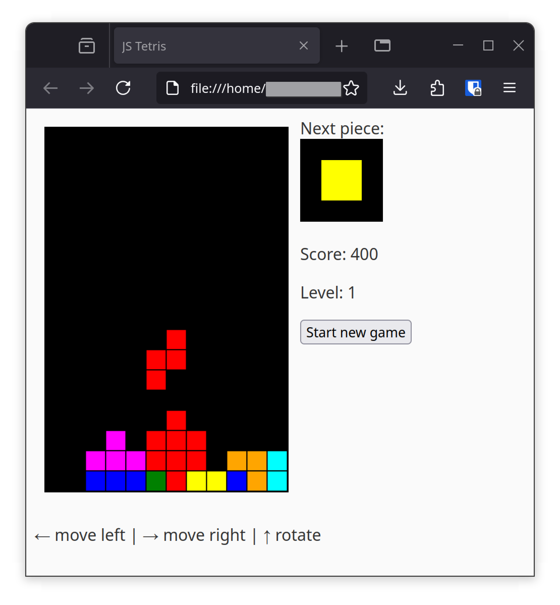

# A simple Tetris clone written in JavaScript



A very simple Tetris clone written in JavaScript using my [SquareGrid.js](https://github.com/SpinningVinyl/SquareGrid.js) library.

## Cloning

This repository uses a Git submodule for SquareGrid.js. Clone it together with its submodule by running:

```sh
git clone --recurse-submodules https://github.com/SpinningVinyl/jsTetris.git
cd jsTetris
```

If you have already cloned the repository without its submodule, initialize it with:

```sh
git submodule update --init --recursive
```

## License

The project is licensed under the terms of MIT License. See LICENSE for details.
