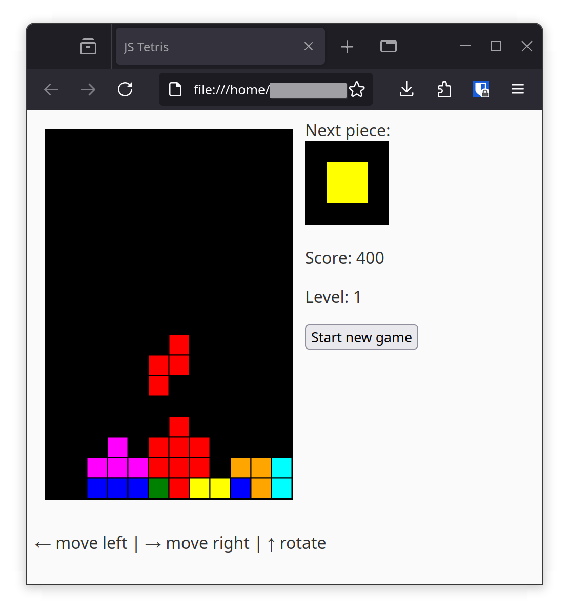

* A simple Tetris clone written in JavaScript

A very simple Tetris clone written in JavaScript using my [SquareGrid.js](https://github.com/SpinningVinyl/SquareGrid.js) library.

** License

The project is licensed under the terms of MIT License. See LICENSE for details.
